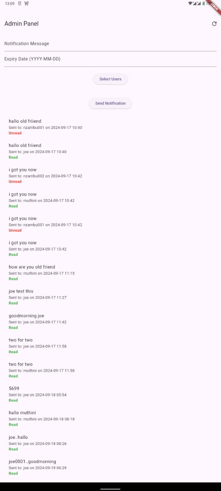
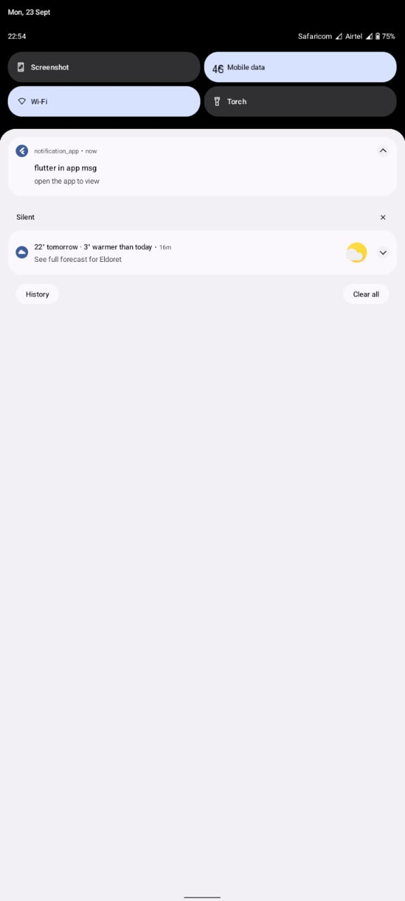

# notification_app

An in-app notification system where an admin, using the web app
backend, can send notifications to specific users in the Flutter app and see if the users have read or not as shown here . 

These notifications will be stored and retrieved from a MySQL database, and delivered through an API.The users can receive the notification in their mobile phones as a pop up on top of the screen as shown here 

## running devices on an ip address using an ip address:
1. adb tcpip 5555
2. device one, adb connect <device-ip>:5555
   device two, adb connect <device-ip>:5555
3. verify connected devices: adb devices